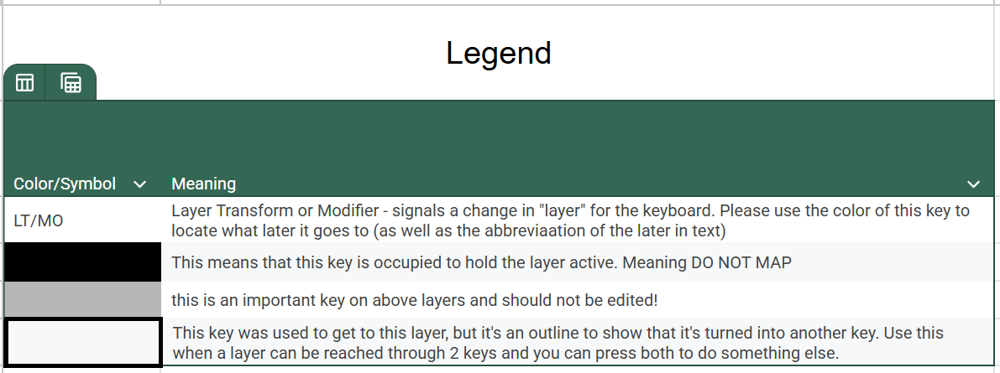
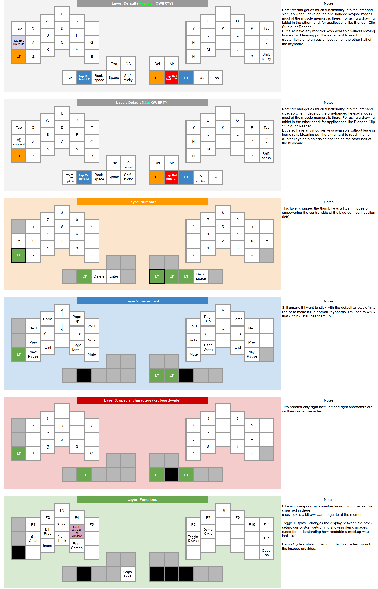

# zmk-config — Kyria Split Keyboard

Personal ZMK firmware config for the [Kyria rev3](https://splitkb.com/kyria) wireless split keyboard, running on Nice!Nano v2 microcontrollers.

ZMK is required for wireless split keyboard support on the Nice!Nano hardware.

## Planned Uses

- **Virtual pet** — a Tamagotchi-style creature living on the OLED displays, fed by keypresses
- **Drawing tablet companion** — one half used as a keypad alongside a Wacom tablet or iPad, keeping shortcuts accessible without a full keyboard on the desk

## Keyboard Layout






## Custom Display Module

The firmware includes a custom Zephyr module (`display_module/`) that extends the OLED displays beyond ZMK's default widgets.

### Display states

`&display_toggle` (bound to ADJ_L) cycles through three states:

| State | What you see |
|---|---|
| **STOCK** | ZMK default: Bluetooth status, battery %, layer number |
| **CUSTOM** | Real layout: info column + virtual pet area |
| **DEMO** | Developer mockup images — cycle through them with `&demo_cycle` |

`&demo_cycle` is a no-op in STOCK and CUSTOM states. It only advances images when in DEMO state.

### Display layout (CUSTOM state, right half)

| Row | Content |
|---|---|
| Top | Split link icon · BT icon · profile number · connection icon |
| Row 2 | Battery / charging icon · battery % |
| Row 3 | OS icon · `L:` · layer name |
| Bottom | Status string (keycount or pet notification, scrolling marquee) |
| Right 62px | Virtual pet area |

### Asset structure

```
resources/
  pet/                    ← pet sprites (.png source + generated .h)
  icons/                  ← UI icons (.png source + generated .h)
  fonts/
    <FontName>/           ← OFL font source + license (can be committed)
    generated/            ← lv_font_conv output .c files (do not edit)
  demos/                  ← generated headers from demos/*.png (do not edit)
demos/                    ← source PNG mockups and font reference images
tools/
  convert_image.py        ← PNG → LVGL image header
  gen_demos.py            ← converts all demos/*.png → demo_list.h
  png_to_icon_font.py     ← PNG icon → single-glyph TTF (for inline text icons)
  build_font.sh           ← rebuilds all font .c files (run after font changes)
display_module/src/
  display_config.h        ← all user-tunable constants (edit here)
```

---

## Usage Guide

### Renaming layers on the display

Layer names shown on the OLED are defined as a compile-time array in `display_module/src/display_config.h`. The index in the array matches the `#define` layer number at the top of `config/kyria_rev3.keymap`.

Edit `LAYER_NAMES_LIST` in `display_config.h`:

```c
#define LAYER_NAMES_LIST \
    "BASE",  /* 0  WINDOWS_L */ \
    "BASE",  /* 1  MAC_L     */ \
    "NUM",   /* 2  NUM_L     */ \
    "MOVE",  /* 3  MOV_L     */ \
    "SYMB",  /* 4  SC_L      */ \
    "FUNC",  /* 5  ADJ_L     */ \
    NULL,    /* 6  unused — shows raw number */ \
    NULL,    /* 7  unused — shows raw number */
```

- Max readable length at the current font size is ~5 characters before the label clips.
- `NULL` entries fall back to the raw layer number (e.g. `L:6`).
- Push to GitHub — Actions rebuilds the firmware automatically.

> **Runtime renaming** (type a name on the keyboard, persist to flash) is planned but not yet implemented. See PLANNED.md.

### Adjusting the display layout

All position, spacing, and font constants are in `display_module/src/display_config.h`. Edit the relevant constant and push — no C code changes needed.

Key constants:

| Constant | What it controls |
|---|---|
| `PET_AREA_X` | Where the info column ends and pet area begins (default: 66px) |
| `ROW_TOP_Y` / `ROW_BATTERY_Y` / `ROW_LAYER_Y` | Vertical position of each info row |
| `ICON_TEXT_GAP` | Gap in pixels between an icon and the text after it |
| `STATUS_MARQUEE_SPEED` | Pixels per second for the bottom status scroll |
| `STATUS_ABBREV_THRESHOLD` | Keycount value above which numbers abbreviate (e.g. `1,000k`) |
| `FONT_BATTERY_NUM` / `FONT_LAYER_L` / etc. | Which font variable each element uses |

### Changing the display font

1. Find an OFL-licensed font — OFL allows committing the `.ttf` to a public repo with attribution.
2. Place the `.ttf` and its `License.txt` in `resources/fonts/<FontName>/`.
3. Edit the `FONT_SRC` line in `tools/build_font.sh` to point to the new file.
4. Run `bash tools/build_font.sh` from the project root.
5. Commit everything under `resources/fonts/` and `resources/fonts/generated/`, then push.

The font variable names in `display_config.h` (`FONT_BATTERY_NUM`, `FONT_LAYER_L`, etc.) do not need to change — they reference the same generated file names.

> **Bold:** BadComic has no bold TTF variant. A fake-bold post-processor (1px right-shift + OR on the bitmap) is planned. See `build_font.sh` for the TODO stub.

### Adding a new UI icon

UI icons appear as standalone image objects (BT icon, battery icon, link icon, etc.).

1. Draw the icon as a **PNG, 13×14px** with a **1px transparent bleed on all sides** (so the visible art is 12×13px). The bleed pixel is placed off-screen when the icon is at a screen edge.
2. Place the PNG in `resources/icons/`.
3. Convert it:
   ```bash
   python3 tools/convert_image.py resources/icons/my_icon.png > resources/icons/my_icon.h
   ```
4. In `display_module/src/custom_display.c`, add `#include "my_icon.h"` at the top and reference `&my_icon` where you want to display it.
5. Push to GitHub.

### Adding a new inline status icon

Inline icons appear inside the scrolling status string at the bottom of the display (e.g., a currency symbol before the keycount). They require a separate pipeline from UI icons because they must live inside the text font.

1. Draw the icon as a **PNG, 13×14px** with 1px bleed (same as UI icons).
2. Place the PNG in `resources/icons/`.
3. Open `tools/build_font.sh` and add an entry under the icon TTF section:
   ```bash
   python3 "$TOOLS/png_to_icon_font.py" \
       "$ICONS/my_icon.png" "$TMP/my_icon.ttf" --codepoint 0xE002
   ```
   Use the next available code point (`0xE001` is taken by the currency icon, so start at `0xE002`).
4. Add the new TTF as an additional `--font` source in the `font_badcomic_11` build command in `build_font.sh`:
   ```bash
   --font "$TMP/my_icon.ttf" --range "0xE002"
   ```
5. Run `bash tools/build_font.sh`.
6. Add a macro for the UTF-8 escape sequence in `display_config.h`:
   ```c
   #define STATUS_ICON_MY_ICON  "\xEE\x80\x82"   // U+E002
   ```
   *(UTF-8 for U+E002 is `EE 80 82`.)*
7. Use the macro in any status string: `STATUS_ICON_MY_ICON "text here"`.
8. Commit `resources/fonts/generated/` and push.

### Adding demo/mockup images

To add a test image to the on-device demo cycle (DEMO display state):

1. Drop the PNG in `demos/`.
2. Run `python3 tools/gen_demos.py` from the project root.
3. Commit the generated files in `resources/demos/` before pushing.

`gen_demos.py` converts every PNG in `demos/` and regenerates `resources/demos/demo_list.h`.

### Adding images and sprites

```bash
# Single image
python3 tools/convert_image.py image.png > resources/pet/my_image.h

# Sprite sheet (e.g. 4 frames, 60×60 each)
python3 tools/convert_image.py sheet.png --sprite-w 60 --sprite-h 60 \
  --names idle_0 idle_1 walk_0 walk_1 > resources/pet/sprites.h
```

Images must be PNG. The display is **monochrome** — pixels with luminance ≥ 128 render as white (lit), below 128 as black (off).

### Building locally

The module path in `build.yaml` is hardcoded to this machine. To build with GitHub Actions CI, the module needs to be extracted to a separate GitHub repo and referenced in `config/west.yml`.

## Architecture

See [DESIGN.md](DESIGN.md) for settled decisions and technical architecture.
See [PLANNED.md](PLANNED.md) for features in progress.
